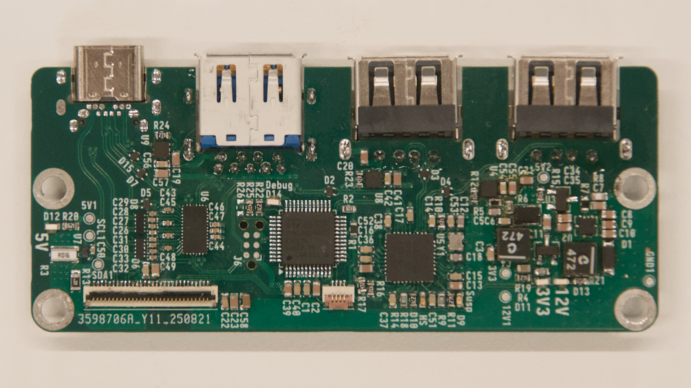

## __USBC-eDP Driver Board__  

This project works to adapt a USB-C DisplayPort alt-mode input into an embedded DisplayPort output. It uses an STM32 to communicate over the USB-C Power delivery protocol, acts as a USB Hub providing one USB 3.0 Superspeed port and 2 USB 2.0 High Speed ports. It also negotiates the highest current available from the source, and internally generates the 12V needed to run the display.  It works by simply routing the same DP signals through to the output, and does no signal processing of it's own. 
## USE  

It should work with most 30pin eDP panels. Since it has no native processing on it's own, the DP generation is set by the computer and panel used. Generally, this allows for up to 1080p panels. Exceptionally large or exceptionally bright panels may not work, as those panels tend to draw a large current on the 12V rail. I highly recommend sticking to panels that draw a continuous current of no more than 800mA for the backlight.

The STM32 provides PWM dimming capability by using the potentiometer on the daughter board. If you want to remove this capability, short pin 1 to pin 2 on J2 (This is a temporary solution, the plan is to in the future specify which brightness control scheme should be used using R25 and R26)

Personally, I am using the Innolux N116BCA-EA1 panel with a 3D printed case published in the Mechanical folder. If you would prefer a 1080p panel, the AUO G116HAN looks like it should also fit the case, however I do not have one to test with. 

#### NOTICE
The USB 2.0 ports are configured to run outside of the USB specification. They claim to be able to provide up to 500mA of current, however trigger overcurrent protection at 250mA. this can be fixed by replacing 
## BUILD INFO

## TODO
Future Plans are mostly in the software:
 - USB HID interface for brightness control and notifications
 - Proper current monitoring and active over-current protection control by reducing screen brightness
 - Use R25 and R26 resistors to define which brightness control method is desired.